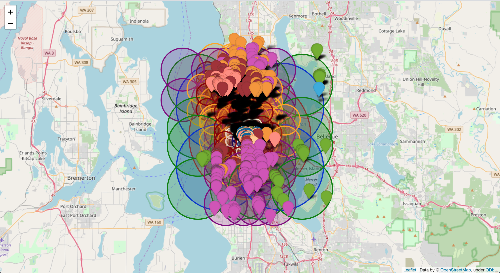

# whatspoppin
Sometimes you are curious about what bars are poppin in your city. Sometimes you also want detailed bar charts populated with Google API data to satisfy your curiosity. This is the command line utility for these times. 

## Install
+ Follow the instructions to install the `populartimes` library: https://github.com/m-wrzr/populartimes
+ Clone this (`whatspoppin`) repo next to your `populartimes` installation
+ Place your Google Cloud api key in `api_keys.env` as the value for `google`

## Run
Identify an area you wish to search. Select a center point marked by longitude and latitude and a radius in meters to cover. 

+ Collect all bars in the area and generate a map
    `python3 divide_and_conquer.py 61.206255 -149.751609 5000`
+ Gather populartimes data and plot the most poppin bars per day of the week
    `python3 popularity_by_day.py out/Bars_61.206255_-149.751609_5000m/place_ids.txt`
